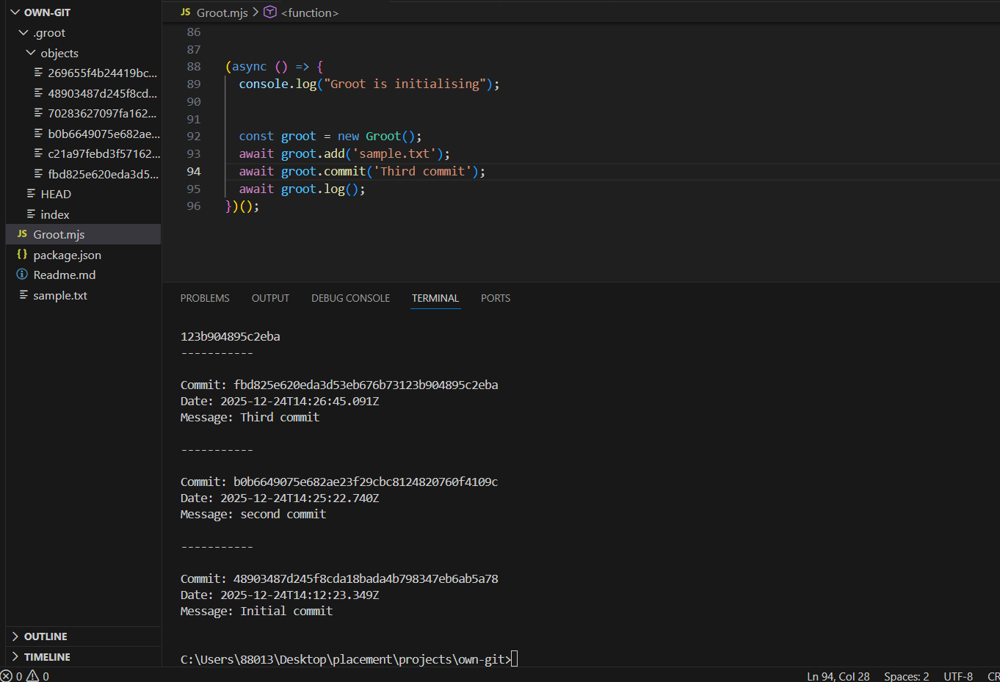

# Groot — Minimal Git-like VCS 🪵

**Groot** (package name: `own-git`) is a small, educational implementation of a Git-like version control system written in Node.js (ES modules). It stores file objects and commits under a local `.groot` directory and provides simple commands to add files, create commits, view logs, and show diffs between commits.

---

## 📋 Table of Contents

- [Features](#-features)
- [Getting Started](#-getting-started)
  - [Requirements](#-requirements)
  - [Install](#-install)
  - [Run examples](#-run-examples)
- [Usage](#-usage)
- [Internals](#-internals)
- [Limitations & Roadmap](#-limitations--roadmap)
- [Contributing](#-contributing)
- [License](#-license)

---

## ✅ Features

- Adds files to a staging area and stores them as SHA-1–named objects in `.groot/objects`
- Creates simple commit objects (message, timestamp, files, parent) and updates `.groot/HEAD`
- Shows commit history by following parent links
- Shows diffs between commits using `diff` and colors via `chalk`

---

## 🔧 Getting Started

### ⚙️ Requirements

- Node.js (14+ recommended)

### 📥 Install

```bash
# Clone the repo
git clone <this-repo>
cd own-git

# Install dependencies
npm install
```

### ▶️ Run examples

The project uses ES modules (`.mjs`). You can run the sample code in `Groot.mjs` directly:

```bash
node Groot.mjs
```

Uncomment the example calls at the bottom of `Groot.mjs` or write a small script to use the `Groot` class.

---

## 🧭 Usage

Programmatically (example):

```js
// Note: currently the class is defined in Groot.mjs; either run that file or export the class
import Groot from './Groot.mjs'; // (you may need to export it first)

const g = new Groot();
await g.add('sample.txt');
await g.commit('Initial commit');
await g.log();
await g.showCommitDiff('<commit-hash>');
```

CLI-style (via running `Groot.mjs`): edit the file to call methods you want and run `node Groot.mjs`.

---

## 🧠 Internals

- `.groot/objects/` — stores raw file contents, named by SHA-1 hash
- `.groot/index` — JSON array acting as the staging area: [{ filePath, fileHash }, ...]
- `.groot/HEAD` — contains the hash of the current commit (or empty)

Commit object structure:

```json
{
  "message": "...",
  "timestamp": "ISO timestamp",
  "files": [{ "filePath": "path", "fileHash": "sha1" }],
  "parent": "parent-commit-hash or null"
}
```

Diffs are calculated using `diff.diffLines()` and colored using `chalk`.

---

## Demo

### 1. show commit logs


### 2. show commit differences

